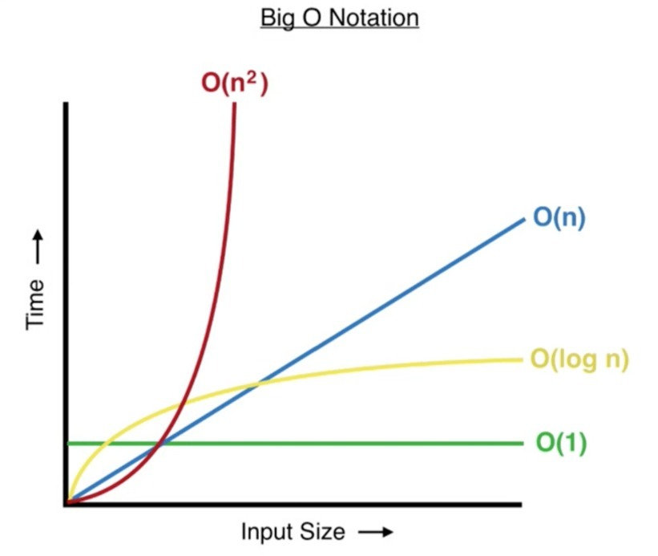

# Data Structures and Algorithms

## Preface

Will be using the repository to -- as they say -- learn in public. Currently going through **"A Common Sense Guide to Data Structures and Algorithms"** by Jay Wengrow. Will be using `Ruby` as my language of choice since it is what I have been working with most heavily over the last year. I may occasionally switch between `JavaScript` and `C#` if I'm feeling particularly adventurous that day, since those are the other 2 languages that I am most familiar with.

Feel free to check out my LinkedIn if you want to connect: [Abdul Redd](https://linkedin.com/in/abdulredd)

 
 

> Note to self: When deciding on a data structure you must consider which one of the 4 main operations -- SEARCH, ACCESS, INSERT, DELETE -- you will be doing most often.

 
 

## Big O Notation

<figure>
  <!-- Original Size is 821 x 693 -->
   
  <caption>Time -> # of algo steps</caption> 
  <caption>Input Size -> # of elements</caption>
</figure>

* O(1) => Constant Time; Always the same irregardless of input size
* O(n) => Linear Time; Increases proportionally as input size increases  
* O(log n) => Logarithmic Time; Halved with each iteration
* O(n^2) => Quadratic Time; Squared to the input size
